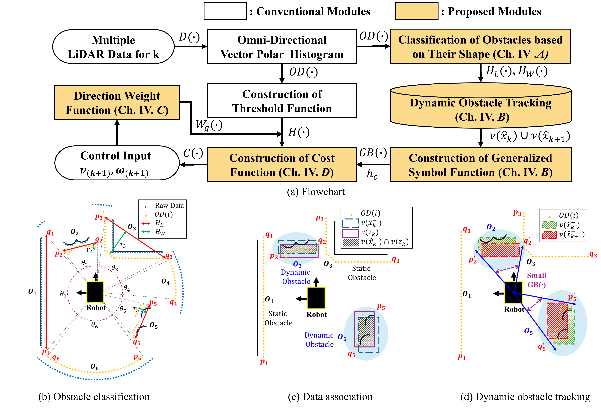
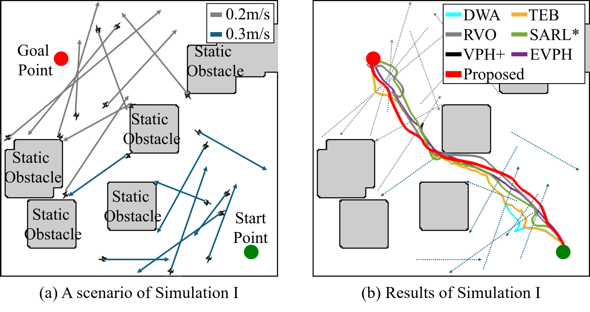
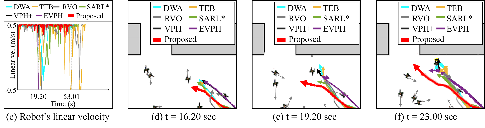
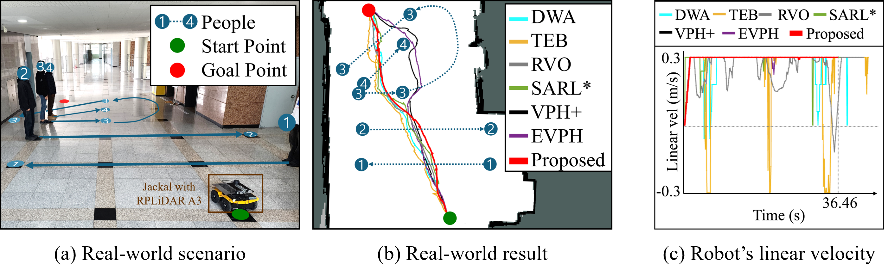

# Advanced EVPH: Advanced Omni-directional Vector Polar Histogram for Robust Navigation in Crowded Environments

This repostiory introduces our paper "Advanced EVPH: Advanced Omni-directional Vector Polar Histogram for Robust Navigation in Crowded Environments" in IEEE Robotics and Automation Letters(RA-L). 

## Introduction
</img>

We propose an Advanced EVPH to improve navigational performance significantly in crowded environments.

## Method Overview
</img>
## System Configuration and Experiment Setup

We selected [Arena-Bench](https://github.com/ignc-research/arena-bench "Arena-Bench") to evaluate a performance of the proposed method. 
The performance is compared with conventional methods as follows:
- Dynamic Window Approach ([DWA](https://wiki.ros.org/dwa_local_planner "dwa_local_planner")),
- Timed Elastic Band ([TEB](https://wiki.ros.org/teb_local_planner "teb_local_planner")),
- Reciprocal Collision Avoidance ([RVO](https://gamma.cs.unc.edu/RVO2 "RVO")),
- Socially Attentive Reinforcement Learning ([SARL*](https://github.com/LeeKeyu/sarl_star "sarl_star")),
- Enhanced Vector Polar Histogram (VPH+),
- Extended Vector Polar Histogram (EVPH).

We use Clearpath Jackal with a single RPLiDAR A3 range sensor.
<!--  -->
</img>

Our simulatuion environment is Ubuntu 20.04 with ROS Noetic, Intel Core i7 10700k, 16GB RAM, Nvidia RTX 3060. 

In real-world experiment, we use a laptop to execute robot framework (SLAM, path planning) with Ubuntu 20.04 with ROS Noetic, AMD Ryzen 5500U, 16GB RAM, Radeon Graphics.

## Simulation I


The green and red circles represent the start and goal points, respectively. The gray and dark blue arrows indicate the paths of people moving at 0.2 and 0.3 m/s, respectively.The environment includes 18 moving people and five static obstacles. In Simulation I, our proposed method, AEVPH reaches the shortest traveling time (49.51 s), and ensures smoother and more efficient navigation through consistent forward movement (0.0064 m/s).

Video demonstration of Simulation I is provided [here](https://youtu.be/YSpLt1Nwoho "Simulation I link")

## Simulation II


The green and red circles represent the start and goal points, respectively. The gray and dark blue arrows indicate the paths of people moving at 0.2 and 0.3 m/s, respectively. The environment includes a narrow path surrounded by static obstacles and crowds. In Simulation II, our proposed method, AEVPH reaches the shortest traveling time (53.01 s), and ensures smoother and more efficient navigation through consistent forward movement (0.0092 m/s).

Video demonstration of Simulation II is provided [here](https://youtu.be/zJltNCrI11U "Simulation II link")

## Real-World
In the real-world experiment, we adjusted to realistic velocity constraints as below:
| Parameters  | Value | 
| ------------- | -------------: |
| max vel x  |0.3 m/s  | 
|  min vel x  | -0.3 m/s  |
| acc lim x  | 0.25 m/s^2 | 
| acc lim theta  | 0.5 rad/s^2  | 

Other parameters are same as simulation scenarios.


The green and red circles represent the start and goal points of the robot, respectively. The dark blue circle indicates the initial position of the persons, and the arrow shows their walking path. In the real-world experiment, our proposed method, AEVPH reaches the shortest traveling time (36.46 s), and ensures smoother and more efficient navigation through consistent forward movement (0.0049 m/s). Also, it operated at an average frequency of 9.2 Hz, ensuring real-time performance.

| Methods  | Collision(Y/N) | Traveling distance(m)  | Traveling time(s) |
| ------------- | :-------------: | -------------: | -------------: |
| DWA  | N  | 10.52 | 38.85 | 
| TEB  | N  | 12.24 | 43.75 |
| RVO  | N  | 10.68 | 42.49 |
| SARL*  | N  | 10.56 | 38.01 |
| VPH+  | N  | 11.10 | 38.96 |
| EVPH  | N  | 10.76 | 38.02 |
| **Proposed**  | N  | 10.66 | **36.46** 

Video demonstration of the real-world experiment is provided [here](https://youtu.be/FMZEZxqv26o "real-world experiment link")

## Additional Cases in Real-World
<!-- </img> -->
</img>
 
Case I: Participants with unstructured movement patterns

</img>

Case II: Participants with predefined paths 

## Citation
```latex
@ARTICLE{11122602,
  author={Lee, Byung-Uk and Lee, Seung-Hwan},
  journal={IEEE Robotics and Automation Letters}, 
  title={Advanced EVPH: Advanced Omni-Directional Vector Polar Histogram for Robust Navigation in Crowded Environments}, 
  year={2025},
  volume={},
  number={},
  pages={1-8},
  doi={10.1109/LRA.2025.3597898}}
```
